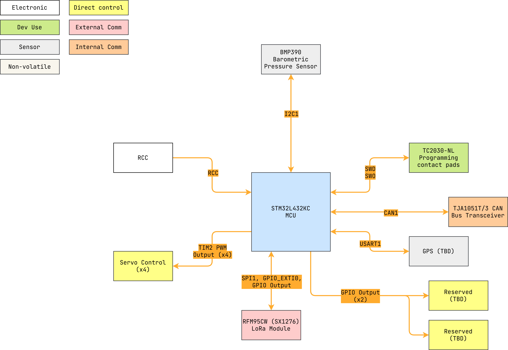

# tandem

STM32L432KC secondary controller to primary Nerve controller.

---

<details markdown="1">
  <summary>Table of Contents</summary>

- [1 Overview](#1-overview)
    - [1.1 Bill of Materials (BOM)](#11-bill-of-materials-bom)
    - [1.2 Block Diagram](#12-block-diagram)
    - [1.3 Pin Configurations](#13-pin-configurations)
    - [1.4 Clock Configurations](#14-clock-configurations)

</details>

---

## 1 Overview

### 1.1 Bill of Materials (BOM)

| Manufacturer Part Number | Manufacturer            | Description                | Quantity | Notes           |
|--------------------------|-------------------------|----------------------------|---------:|-----------------|
| NUCLEO-L432KC            | STMicroelectronics      | Nucleo-64 board            |        1 | Do not populate |
| 4816                     | Adafruit Industries LLC | BMP390 Dev board           |        1 | Do not populate |
| 5708                     | Adafruit Industries LLC | TJA1051T/3 Dev board       |        2 | Do not populate |
| STM32L432KC              | STMicroelectronics      | 32-bit MCU                 |        1 |                 |
| BMP390                   | Bosch Sensortec         | Barometric Pressure Sensor |        1 |                 |
| TJA1051T/3               | NXP USA Inc.            | CAN Bus Transceiver        |        1 |                 |
| TBD                      | TBD                     | GPS Module                 |        1 |                 |
| RFM95CW                  | Adafruit Industries LLC | (SX1276) LoRa Module       |        1 |                 |

### 1.2 Block Diagram



> Drawio file here: [tandem.drawio](docs/tandem.drawio)

### 1.3 Pin Configurations

<details markdown="1">
  <summary>CubeMX Pinout</summary>


</details>

<details markdown="1">
  <summary>Pin & Peripherals Table</summary>

| STM32F446RE | Peripheral  | Config     | Connection            | Notes                               |
|-------------|-------------|------------|-----------------------|-------------------------------------|
| PB3         | SWO         |            | SWD/JTAG (ie: TC2050) |                                     |
| PA14        | TCK         |            | SWD/JTAG (ie: TC2050) |                                     |
| PA13        | TMS         |            | SWD/JTAG (ie: TC2050) |                                     |
| PA0         | TIM2_CH1    | PWM output | Servo (TBD)           |                                     |
| PA1         | TIM2_CH2    | PWM output | Servo (TBD)           |                                     |
| PA2         | TIM2_CH3    | PWM output | Servo (TBD)           |                                     |
| PA3         | TIM2_CH4    | PWM output | Servo (TBD)           |                                     |
| PA5         | SPI1_SCK    |            | RFM95CW Pin 4: SCK    |                                     |
| PA4         | SPI1_NSS    |            | RFM95CW Pin 5: NSS    |                                     |
| PA6         | SPI1_MISO   |            | RFM95CW Pin 2: MISO   |                                     |
| PA7         | SPI1_MOSI   |            | RFM95CW Pin 3: MOSI   |                                     |
| PB0         | GPIO_Output |            | RFM95CW Pin 6: NRESET | Default reset, pull low to turn on. |
| PB6         | I2C1_SCL    |            | BMP390 Pin 2: SCK     |                                     |
| PB7         | I2C1_SDA    |            | BMP390 Pin 4: SDI     |                                     |
| PA10        | USART1_RX   | 115200 bps | GPS (TBD)             |                                     |
| PA9         | USART1_TX   | 115200 bps | GPS (TBD)             |                                     |
| PA11        | CAN1_RX     |            | TJA1051T/3 Pin 4: RXD |                                     |
| PA12        | CAN1_TX     |            | TJA1051T/3 Pin 1: TXD |                                     |
| PB1         | GPIO_Output |            | Reserved              |                                     |
| PA8         | GPIO_Output |            | Reserved              |                                     |

</details>

### 1.4 Clock Configurations

```
16 MHz High Speed Internal (HSI)
↓
Phase-Locked Loop Main (PLLM)
↓
80 MHz SYSCLK
↓
80 MHz HCLK
↓
 → 80 MHz APB1 (Maxed) → 80 MHz APB1 Timer
 → 80 MHz APB2 (Maxed) → 80 MHz APB2 Timer
```
